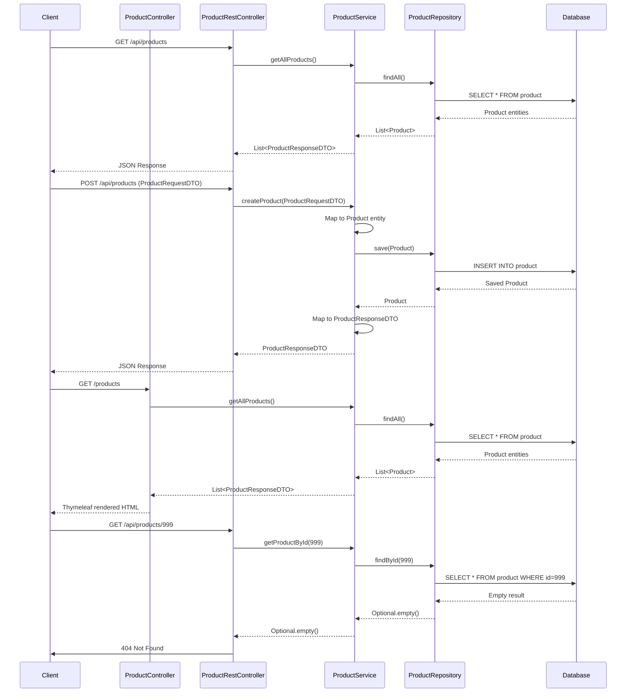

# Spring Boot 3.4 Product Management Application

## Overview

This application is an exemplary Spring Boot 3.4 product management system that demonstrates modern Java development practices and architecture patterns. It follows a well-structured layered architecture with clean separation of concerns while incorporating Spring Boot best practices and industry standards.

## Architecture

The application follows a classic layered architecture:

1. **Presentation Layer**: Contains controllers for both web UI (Thymeleaf-based) and REST API interfaces
2. **Service Layer**: Implements business logic and transaction management
3. **Data Access Layer**: Provides repository interfaces for database operations
4. **Domain Layer**: Defines entity models and value objects

### Directory Structure

```
src/
 ├── main/
 │   ├── java/app/quantun/backend/
 │   │   ├── BackendApplication.java        (Main entry point)
 │   │   ├── ServletInitializer.java        (For servlet container deployment)
 │   │   ├── config/                        (Configuration classes)
 │   │   │   ├── ModelMapperConfig.java     (ModelMapper bean configuration)
 │   │   │   ├── OpenApiConfig.java         (Swagger/OpenAPI config)
 │   │   ├── controller/                    (MVC controllers for web UI)
 │   │   │   ├── ProductController.java     (Web UI controller)
 │   │   ├── rest/                          (REST controllers)
 │   │   │   ├── ProductRestController.java (REST API endpoints)
 │   │   ├── service/                       (Business logic)
 │   │   │   ├── ProductService.java        (Service interface)
 │   │   │   ├── ProductServiceImpl.java    (Service implementation)
 │   │   ├── repository/                    (Data access)
 │   │   │   ├── ProductRepository.java     (JPA repository)
 │   │   ├── models/                        (Domain models)
 │   │   │   ├── entity/
 │   │   │   │   ├── Product.java           (JPA entity)
 │   │   │   ├── contract/
 │   │   │   │   ├── request/
 │   │   │   │   │   ├── ProductRequestDTO.java (Request DTO)
 │   │   │   │   ├── response/
 │   │   │   │   │   ├── ProductResponseDTO.java (Response DTO)
 │   │   ├── exception/                     (Custom exceptions)
 │   │   │   ├── GlobalExceptionHandler.java (Exception handling)
 │   │   │   ├── ProductNotFoundException.java (Custom exception)
 │   ├── resources/
 │   │   ├── application.properties         (Application configuration)
 │   │   ├── messages.properties            (Validation messages)
 │   │   ├── templates/                     (Thymeleaf templates)
 │   │   │   ├── master.html                (Layout template)
 │   │   │   ├── form.html                  (Product form template)
 │   │   │   ├── list.html                  (Product list template)
```

## Key Features

### 1. Dual Interface

The application provides two interfaces:
- **Web UI**: Thymeleaf-based MVC interface with Tailwind CSS for styling
- **REST API**: RESTful endpoints for programmatic access

### 2. Clean Domain Modeling

- **Entity Layer**: JPA entities with proper validation annotations
- **DTO Pattern**: Separate DTOs for requests and responses, preventing entity exposure
- **Mapping**: ModelMapper for object transformation

### 3. Robust Exception Handling

- Centralized exception handling with `@RestControllerAdvice`
- Custom exceptions for specific error scenarios
- Consistent error responses using Spring's ProblemDetail

### 4. Comprehensive API Documentation

- OpenAPI/Swagger integration for API documentation
- Detailed annotations on controllers and methods
- Example values for request/response schemas

### 5. Validation

- Bean Validation (JSR-380) for input validation
- Internationalized validation messages
- Proper error handling and display

### 6. Proper Dependency Injection

- Constructor injection using Lombok's `@RequiredArgsConstructor`
- Immutable dependencies with `final` fields

### 7. Transactional Management

- Proper `@Transactional` annotations on service methods
- Clear boundaries for transaction scopes

### 8. Comprehensive Logging

- SLF4J with Lombok's `@Slf4j` for consistent logging
- Proper log levels for different environments
- Contextual logging with relevant information

## Sequence Diagram



## Compliance with Best Practices

This application closely follows the Spring Boot 3.4 Best Practices Guidelines:

### Architecture

- ✅ Proper layered architecture with clear separation of concerns
- ✅ Service-oriented structure with cohesive services
- ✅ Externalized configuration
- ✅ Consistent directory structure

### Controllers

- ✅ REST principles for resource naming and HTTP methods
- ✅ Thin controllers that delegate to services
- ✅ Proper HTTP status codes
- ✅ Dedicated DTOs for request/response

### Exception Handling

- ✅ Global exception handler with `@RestControllerAdvice`
- ✅ Custom exceptions for different scenarios
- ✅ Consistent error responses with appropriate HTTP status codes

### Libraries and Dependencies

- ✅ Spring Data JPA for database access
- ✅ Spring Validation for input validation
- ✅ ModelMapper for object mapping
- ✅ Lombok for reducing boilerplate
- ✅ Proper logging with SLF4J

### Code Quality

- ✅ Constructor injection over field injection
- ✅ Immutable dependencies with `final` fields
- ✅ Comprehensive logging
- ✅ Clear exception handling
- ✅ Separation of concerns

## Testing Strategy

The application implements a comprehensive testing strategy following best practices:

### 1. Testing Layers

- **Unit Tests**: Testing individual components in isolation with mocked dependencies
- **Integration Tests**: Testing interactions between components
- **Application Tests**: Verifying the application context loads correctly

### 2. Test Organization

- `AllTestsRunner.java`: JUnit 5 test suite runner for executing all tests
- `BackendApplicationTests.java`: Verifies the Spring context loads successfully
- `ProductControllerTest.java`: Tests the web UI controller using `@WebMvcTest`
- `ProductRestControllerTest.java`: Tests the REST API controller using `@WebMvcTest`
- `ProductServiceTest.java`: Unit tests for the service layer using `@ExtendWith(MockitoExtension.class)`

### 3. Testing Techniques

- **MockMvc**: Used for testing Spring MVC controllers without starting a real server
- **Mockito**: Used for mocking dependencies
- **@MockitoBean**: For replacing beans in the Spring context with mocks
- **@InjectMocks**: For injecting mocks into the class under test
- **JUnit 5**: Modern testing framework with parameterized tests, display names, etc.

### 4. Test Coverage

The tests cover:
- Happy path scenarios (successful operations)
- Error handling (not found, validation failures)
- Edge cases (empty results, invalid inputs)

### 5. Best Practice Implementations

- Clear test method naming that describes the behavior being tested
- Proper setup with `@BeforeEach` for test data preparation
- Appropriate mocking and verification of interactions
- Testing of validation constraints
- Comprehensive assertions checking both direct outputs and side effects

## Areas for Potential Enhancement

While the application is well-structured, there are some opportunities for enhancement:

1. **Security Implementation**: Adding Spring Security for authentication and authorization
2. **Caching**: Implementing caching for frequently accessed data
3. **Pagination**: Adding pagination for large data sets in the REST API
4. **API Versioning**: Clear versioning strategy for API evolution
5. **Database Migrations**: Integrating Flyway or Liquibase for database schema management
6. **Monitoring**: Adding Spring Actuator endpoints for health checking and monitoring

## Conclusion

This Spring Boot 3.4 Product Management application serves as an excellent reference implementation that demonstrates modern Java development practices. It provides a solid foundation that can be extended for more complex business requirements while maintaining a clean, maintainable codebase that adheres to industry best practices.

The project showcases the power of Spring Boot's convention-over-configuration approach while still implementing a clear separation of concerns and following solid object-oriented design principles. The dual interface (web UI and REST API) approach demonstrates flexibility in serving different client needs, and the consistent error handling and validation provide robustness needed for production applications.